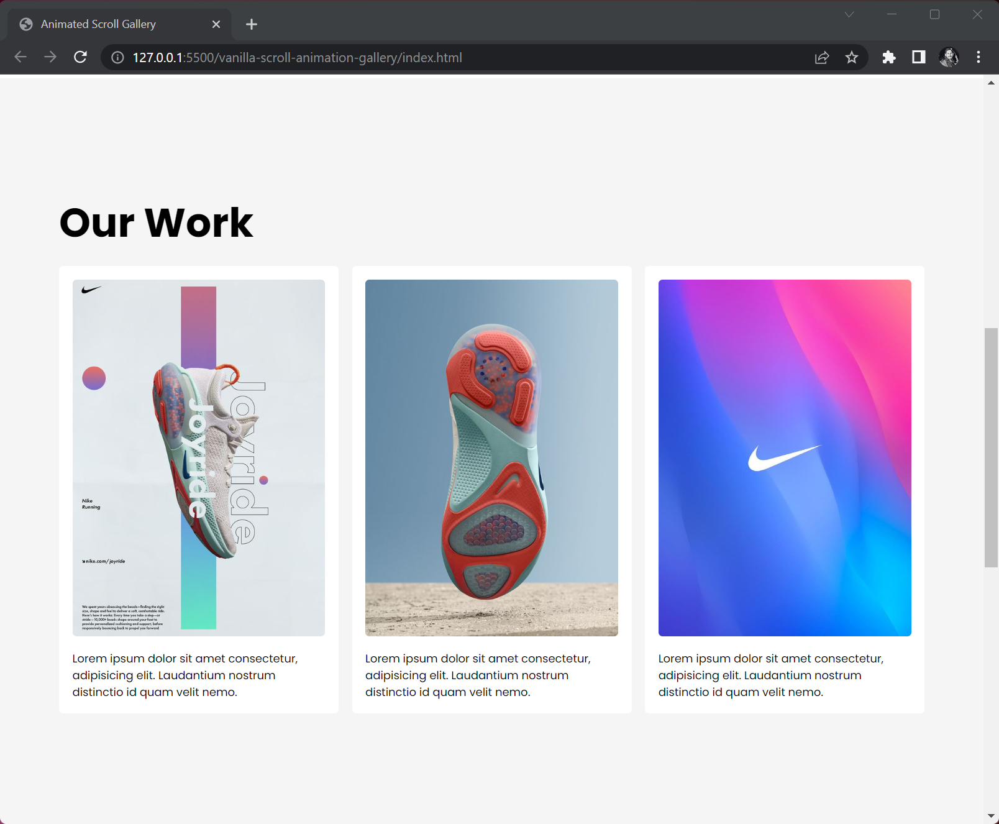

## Random rotation and position Animation

> This code uses the Greensock animation library (gsap) to animate elements. The animation is triggered when the user scrolls toward an element `div` with a class of work.



Usage

- Include the gsap library in your project.
- Add the class img to the elements you want to animate.
- Add the class work to the element that you want to use as the trigger for the animation.

```js
const cards = document.querySelectorAll(".img");

// create a new timeline object using the Greensock animation library (gsap)
let tl = new gsap.timeline({
  // setup the `scrollTrigger` property of the `tl` timeline.
  // it's triggered when the user scrolls to the element with a class of `work`.
  // animation starts at top and bottom of the element & ends 700px beyond it.
  // scrub 1 means animation fires every time user scroll toward trigger.
  scrollTrigger: {
    trigger: ".work",
    start: "top bottom",
    end: "+=700",
    scrub: 1,
  },
});

// loop through each element in the `cards`.
cards.forEach((img) => {
  // create a random rotation value between -20 and 20
  let rotation = Math.floor(Math.random() * 40) - 20;
  // create a random X position value between -150 and 150
  let positionX = Math.floor(Math.random() * 300) - 150;
  // create a random Y position value between -150 and 150
  let positionY = Math.floor(Math.random() * 300) - 150;

  // add a new animation to the `tl` timeline for the `img` element.
  // use the random rotation and position values for this iteration.
  tl.from(
    img,
    {
      rotation: rotation,
      x: positionX,
      y: positionY,
    },
    "-=1"
  );
  // add another animation to the `tl` timeline.
  // here we change the `img` element's background size back down to 100%.
  // remember the default size is 170% so its scaling down.
  tl.to(
    img,
    {
      backgroundSize: "100%",
    },
    ".2"
  );
});
```

Regards, <br />
Luigi Lupini <br />
<br />
I ❤️ all things (🇮🇹 / 🛵 / ☕️ / 👨‍👩‍👧)<br />
